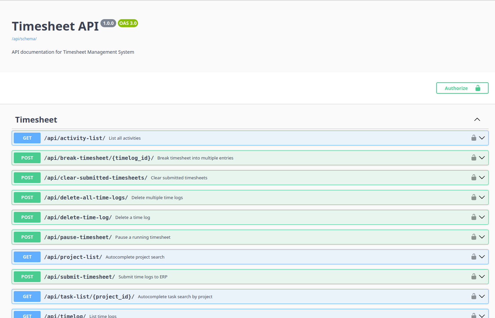

# Timesheet Project

Django+react timesheet app that can post the time logs to the erpnext. 

## Configuring Local Instance
Please refere to [this document](docs/setup.md) to configure local instance.

## Accessing API Documentation
Go to `/api/docs/` to show API Documentation.
