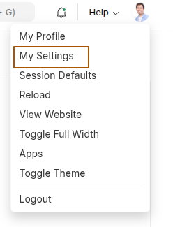
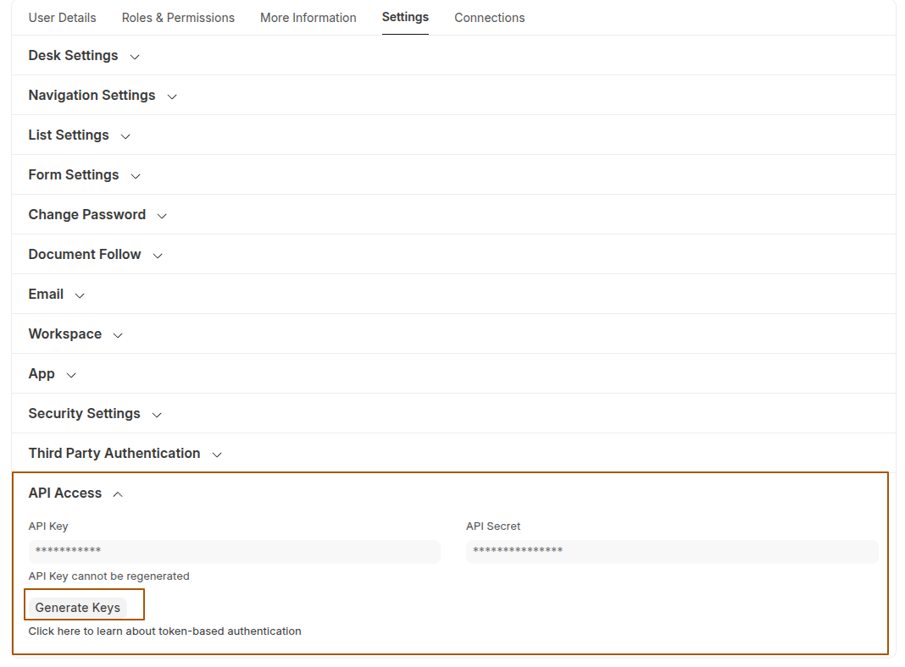

# Configuring Local Instance

## Prepare Django App
- Set environment variable `ERPNEXT_SITE_LOCATION` to `https://dev-staging.m.frappe.cloud`. Make sure no trailing slash in the URL.
```
export ERPNEXT_SITE_LOCATION=https://kartoza-dev-15.m.frappe.cloud
```
- Create Python virtual environment
```
python -m venv .venv
```
- Activate virtual environment
```
source .venv/bin/activate
```
- Install requirements.txt
```
pip install -r requirements.txt
```
- Run Django migration
```
python manage.py migrate
```
- Create new superuser. Use your Kartoza email as username and email.
```
python manage.py createsuperuser
```
- Run development server.
```
python manage.py runserver
```

## Populate Data from ERPNext
### Generate API Key and API Secret
- Login to https://dev-staging.m.frappe.cloud
- Click, your profile icon on the top right corner. Select `My Settings`

- You should be taken to `Settings` tab in your user profile.
- Look for `API Access` section, usually located below `Third Party Authentication`. If you can't find it, contact your adminstrator to give you correct permission.
- Once you see `API Access` section, click down arrow to show the content. Click `Generate Keys`.



- Copy and save the API Key and API Secret securely, as ERPNext will only show this key:secret pair once. If you forget, you neeed to regenerate it.

### Enter API Key and API Secret
- Go to Timesheet Project admin page, usually at `localhost:8000/admin`.
- Login with the username and password you've created.
- Go to directly to `http://localhost:8000/admin/auth/user/1/change/`, scroll down to `Profile` section.
- Enter your API Key and API Secret correctly. Do not mix them up.
- Click `Save` at the bottom of the screen.

### Fetch Data from ERP Next
- In terminal, run
```
python manage.py update_erp_data
```
- This should populate your Projects, Tasks, Public Holidays, and many more.
- Once finished, confirm by checking
```
http://localhost:8000/admin/timesheet/project/
http://localhost:8000/admin/timesheet/task/
http://localhost:8000/admin/timesheet/userproject/
http://localhost:8000/admin/pmo_dashboard/businessunit/
```